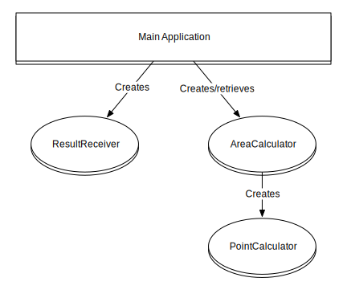
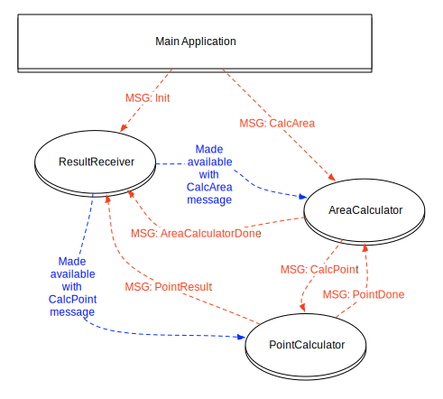

## Parallelization with Actors in C#

> Oliver Sturm &bull; @olivers &bull; oliver@oliversturm.com

&nbsp;&nbsp;

---

## Oliver Sturm

* Training Director at DevExpress
* Consultant, trainer, author, software architect and developer for over 25 years
* Microsoft C# MVP

* Contact: oliver@oliversturm.com

---

## Agenda

* Actors? What’s that?
* Cool stuff in Erlang
* Akka.NET
  * Basics
  * Parallelization
  * Remoting
  * Supervision

---

## Actors? What's that?

* Old idea (1973)
* Implemented as libraries and frameworks for very many programming languages
* Famously a feature of the Erlang language/environment
  * Erlang has been used by Facebook and WhatsApp as a platform for their chat services

---

## Actors? What's that?

* An actor can wait for incoming messages
* It can send messages to other actors
* It can create new actors to work under its supervision
* Idea: actors should work together like human team members. Well, actually they should work together much better than human team members :)

---

## Demo

Actors in Erlang

---

## Features of Actor systems

* Provide high level abstraction of services that can run in parallel or in distributed systems
* Build actor hierarchies where parents monitor children for failure
  * Actors can follow different strategies to deal with failure: restart child actors, stop them, escalate issues to their respective parents
  * Correctly implemented, this can provide "self-healing" systems

---

## Akka.NET

* Open Source, ported from Akka for JVM
* Runs on .NET and Mono
  * I've had a bit of trouble with some features on Mono though
* Usable in any .NET language, special integration for F#
* Full actor system implementation, also has special types for finite state machines, actor state persistence and streaming
* Infrastructure for remoting and clustering

---

## Demo

Akka.NET Hello World

---

## Demo

Akka.NET Mandelbrot

Transitioning to an actor system

---

## Actors in the system

---

## Interaction between actors

---

## Akka.NET Remoting

* Don't confuse with .NET Remoting!
* Actors don't have to run on the same system
* Peer-to-peer network of actors
* Transports etc configurable
* `ActorSelection` used to get hold of actors running elsewhere
* Actors can be "deployed" (remotely started) elsewhere
* Distributed systems can be configured externally!

---

## Demo

Akka.NET Remoting

---

## Supervision/Monitoring

* Parents control their children
* When children fail, parents decide on a strategy to handle the problem
* Any behavior applied to a failed child is transparent from the `IActorRef` perspective

---

## Demo

Supervision/Monitoring

---

## Sources

Demo source code: https://github.com/oliversturm/parallelization-with-actors-in-cs-demos

This presentation: https://oliversturm.github.io/parallelization-with-actors-in-cs-demos

---

## Thank You

Please feel free to contact me about the content anytime.

oliver@oliversturm.com
